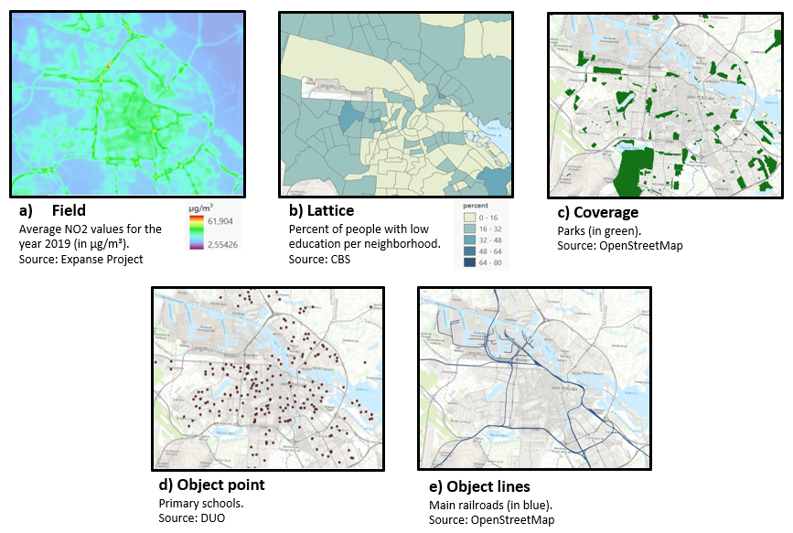
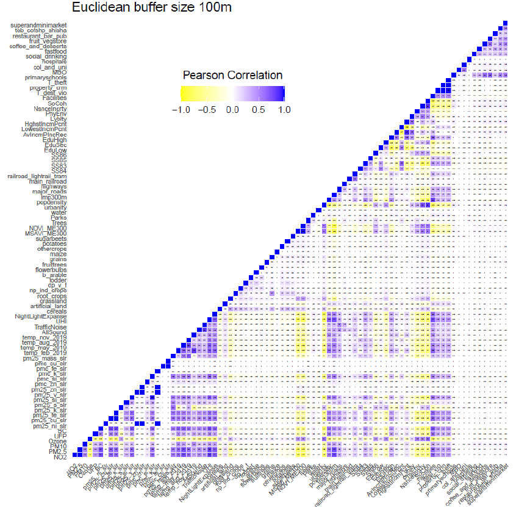
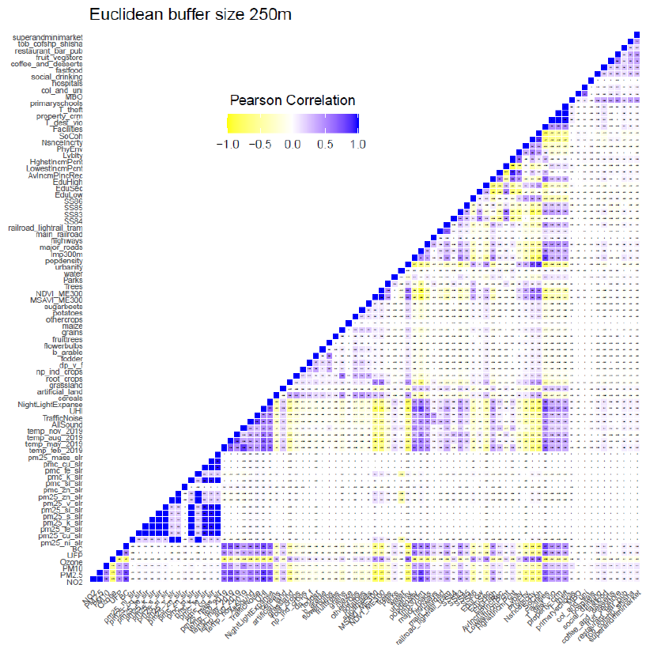
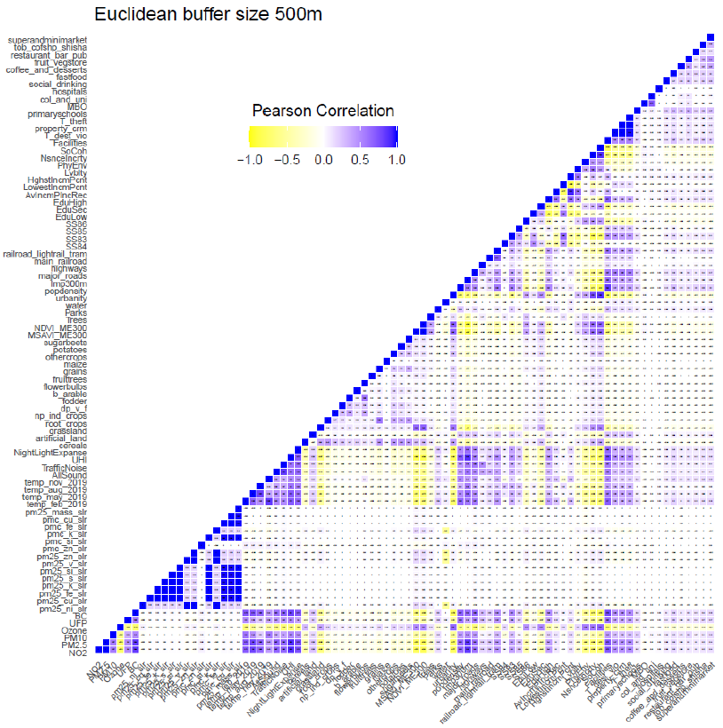
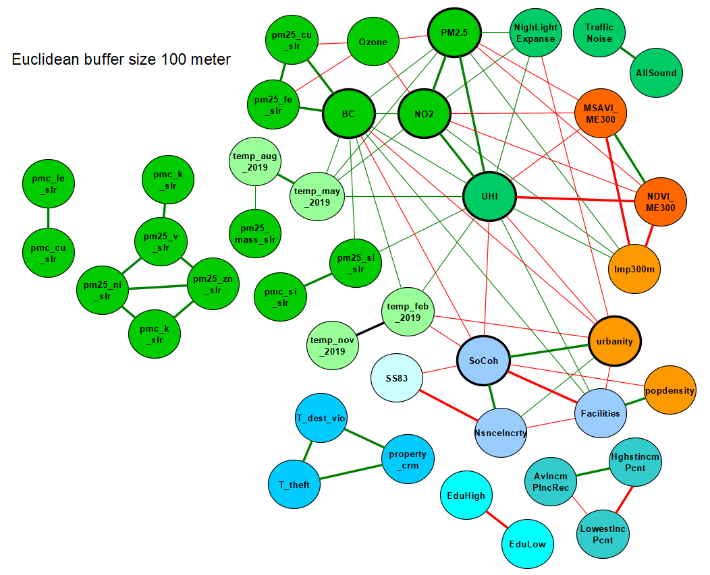
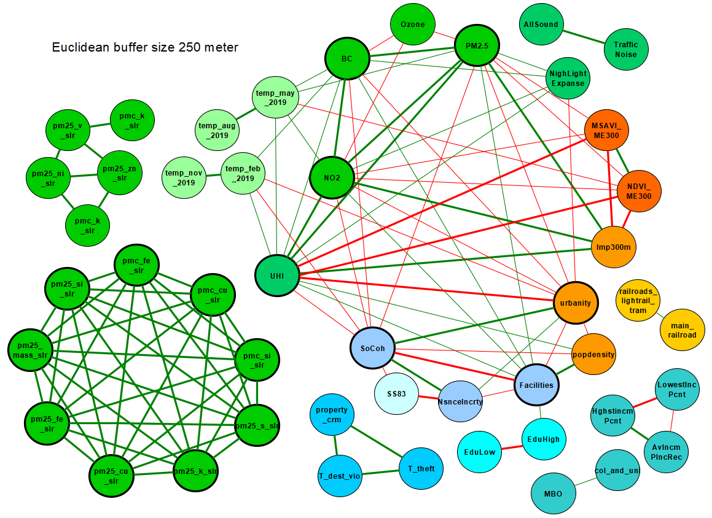
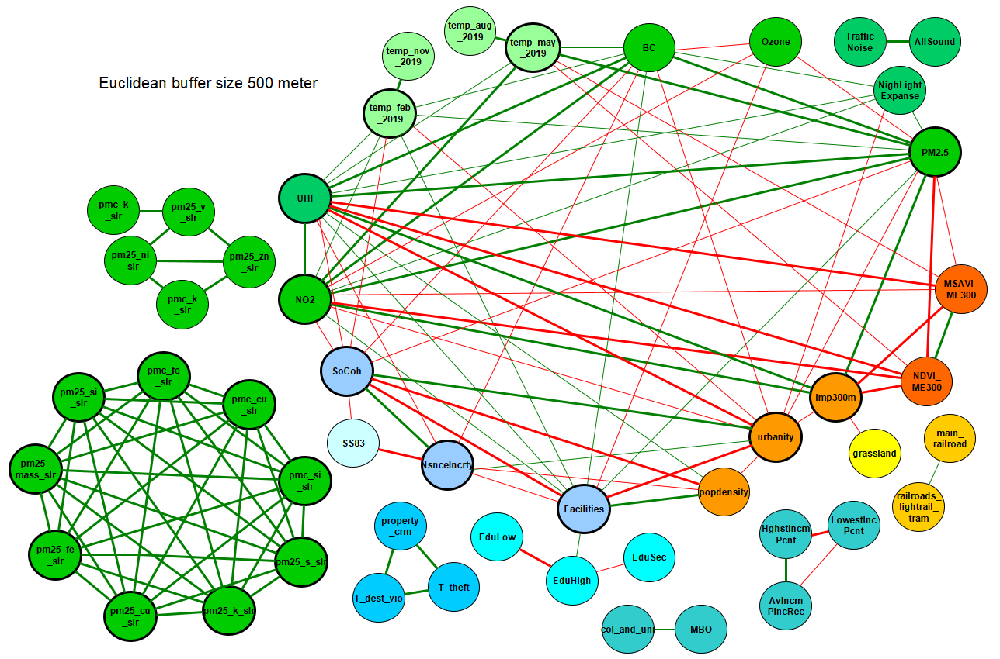
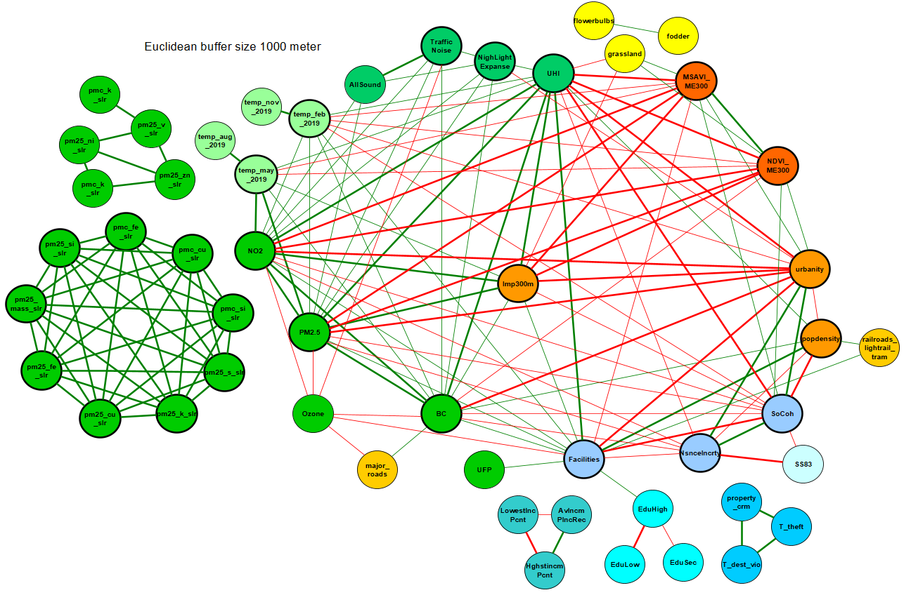

*How Spatial Scale and Collinearity Influence Environmental Exposure Models*
  

## Different types of spatial dataset types

## Heatmaps of Pearson correlation values
Pearson correlation values of all environmental factors around residential addresses within each Euclidean buffer size.

## Heatmap of 100 meter buffer with all variables

## Heatmap of 250 meter buffer with all variables

## Heatmap of 500 meter buffer with all variables

## Heatmap of 1000 meter buffer with all variables

## Network graphs
Network graphs showing all Pearson correlation values for each Euclidean buffer size that had a Pearson correlation value of more than 0.7 (green vertices) or less than -0.7 (red vertices). Pearson correlation values that are 0.8 or more, or -0.8 or less, have thicker vertices. Environmental factors that have seven or more correlations with other factors have a thicker outline around the circle representing the environmental factor. The colour coding for the environmental factors is as follows: Green = physico-chemical category, orange/yellow = built category, and blue = social category. Different shades of each colour represent different subgroups.

## Network graph of 100 buffer with all variables

## Network graph of 250 buffer with all variables

## Network graph of 500 buffer with all variables

## Network graph of 1000 buffer with all variables

