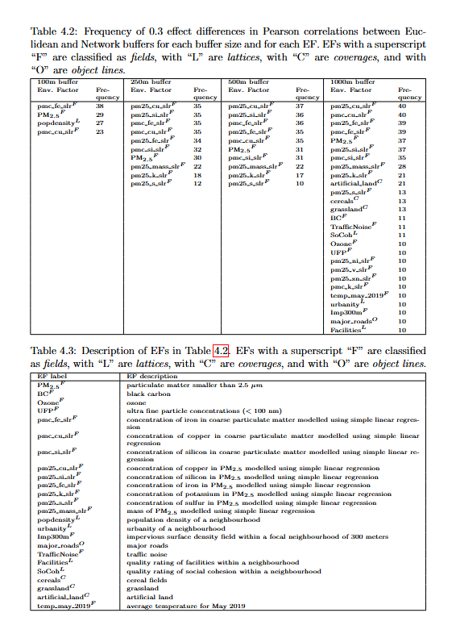

*The role of spatial context definitions for environmental factors*
  

## Different types of spatial data, shown in the city of Amsterdam, the Netherlands as an example.

## Examples of two measurement methods: Euclidean buffer (blue circle) and convex hull network buffer (green polygon).

## Results table

