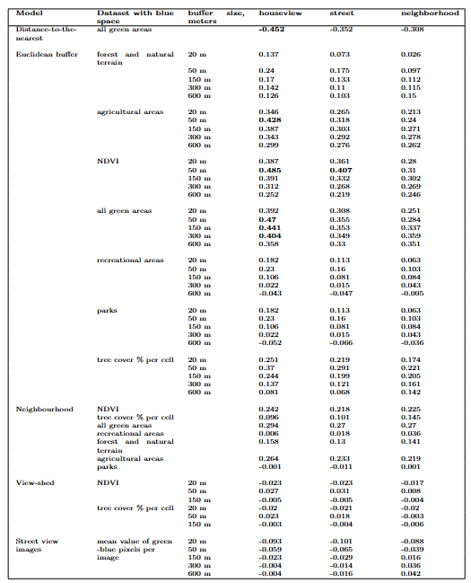
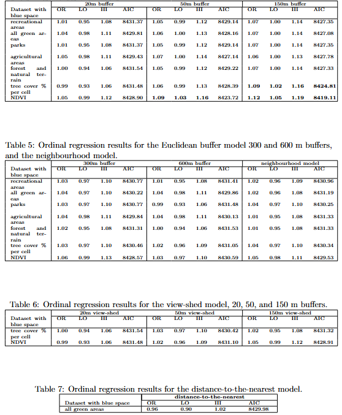

*Perceived Green and Blue Space, Spatial Scale, and Health. A Comparative Assessment of Exposure Metrics*
  

## Partial Spearman correlations for each survey question and for each model result are shown. The highest performing values are in bold.

## Ordinal regression results

