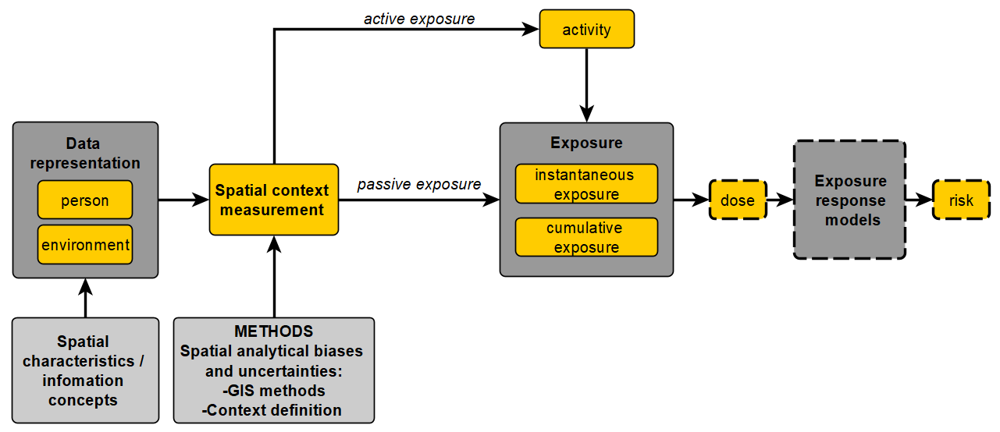

### Title:  Environmental exposure estimation: How spatial data and measurement methods impact quantifications

**Human Geography and Spatial Planning, Institute of Risk Assessment Sciences; Utrecht University, The Netherlands**  
* In collaboration with the **Exposome NL** project *
*03/2021 – Present*

###Brief Introduction
The environment impacts our health directly and indirectly in countless ways. Examples include air pollution associated with asthma [1–3], traffic noise affecting the ability to concentrate [4–6], crime potentially leading to injuries [7–9], lack of green space associated with poor mental health [10–12], and a lack of grocery stores near residences potentially leading to an unhealthy diet [13–15]. These elements of the environment constitute environmental factors of health. Exposure to such factors over time and in space increases the risk of effects on an individual’s health. The idea of measuring all the possible exposures to such environmental factors an individual experiences in a lifetime, and how those exposures affect health, is called the exposome, a term coined by Wild in [16]. This term was created to complement the genome, to acknowledge that not only do genes, but also the broader non-genetic environment, contribute to health. Wild also recognised the need for methodological developments in exposure assessments, acknowledging that measurement is difficult due to the complex nature of the environment, yet there is a necessity for addressing methodological gaps and improving exposure assessment in epidemiological studies [16]. Methodological investigations of environmental exposure assessments require collaboration between multiple fields, including epidemiologists and specialists for representing and measuring the built environment. Among the latter are geographers as well as geoinformation scientists [17–19]. While epidemiologists are increasingly pursuing studies to understand how the built environment impacts health, understanding the underlying spatial concepts and investigating whether spatial measurements are appropriate for the underlying purpose is done less often, and if so, often not in a systematic manner. In particular, the relationship between concepts of an epidemiological study, their representation in spatial datasets, and possible spatial context measurement methods that are used to quantify exposure has not been investigated comprehensively in terms of their appropriateness for the purposes of measuring the exposome. Researchers tend to adopt standard methods used by previous research instead of exploring different ways to represent the environment [20, 21]. For this reason, it remains to a large extent unknown how the use of different spatial representations and geocomputational methods influences the quality of exposome models.

###Brief Discussion
In environmental epidemiology, the relationships between people, the en-
vironment, and exposure have long been recognised. However, few studies
have systematically examined the impact of geographic context and spa-
tial methods on these relationships and, ultimately, on epidemiological
inference. A key reason for this is the limited interdisciplinary integra-
tion between epidemiology and geoinformation science. As a result, it
has remained difficult to systematically compare different spatial con-
text measurement methods and spatial representations in terms of their
influence on exposure measurements for epidemiological investigations.
In this thesis, I proposed an ontology of passive and active exposure that
clarifies the different ways in which spatial representations of the environ-
ment, activities and exposed persons can be related to each other, based
on whether environments are conceptualised as direct or indirect causes of
exposure. I also investigated the influence of spatial representations and
geocomputational methods on the quality of spatial exposure models.
These gaps were addressed by examining and specifying essential con-
cepts (environmental exposure concepts, spatial information concepts,
and spatial context measurement methods) and by examining their re-
lationships to each other and how they can be used to model exposure
to environmental factors of interest. A diagram showing these essential
concepts and how they connect to each other is shown in Figure 6.1.
Based on this general model, I designed various geocomputational ana-
lyses to test the effects of different spatial representations as well as con-
text measurements over a large range of commonly used environmental
factors in epidemiology and exposome research. While these studies were
mostly co-variation studies that quantified these effects in terms of correl-
ations between various environmental factors, in the last study (Chapter
5), I also assessed the quality of specific methodological choices regarding
spatial context measurement for the purpose of epidemiological studies
using ground truth data on perceived green-blue space.
This contributes to a better understanding of the relevance of the com-
bination of spatial representations and spatial context measurements.
Results underscore the importance of considering the type of geospatial
representation, spatial context measurement methods, as well as their
relationships to epidemiological concepts such as activities, person, loc-
ation, and the way exposure is quantified.

###Conclusion
This thesis has demonstrated that data characteristics, geospatial concepts, and spatial context measurement methods fundamentally shape exposure modelling in environmental epidemiology. By combining onto-
logical specification of exposure models with systematic empirical analyses, this thesis revealed how variations in spatial data representations and methodological choices of context measurements can substantially
influence exposure estimates. The results emphasise that understanding and explicitly accounting for GIS-related phenomena such as MAUP is essential to achieving reliable exposure assessments. Furthermore, this thesis suggests a conceptual and methodological start for bridging the gap between epidemiology and geoinformation science, underscoring the importance of interdisciplinary integration for advancing exposome research. Ultimately, this work highlights that improved awareness of spatial concepts and their methodological implications leads to more accurate, transparent, and meaningful exposure assessment in environmental epidemiology.
