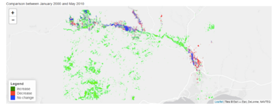
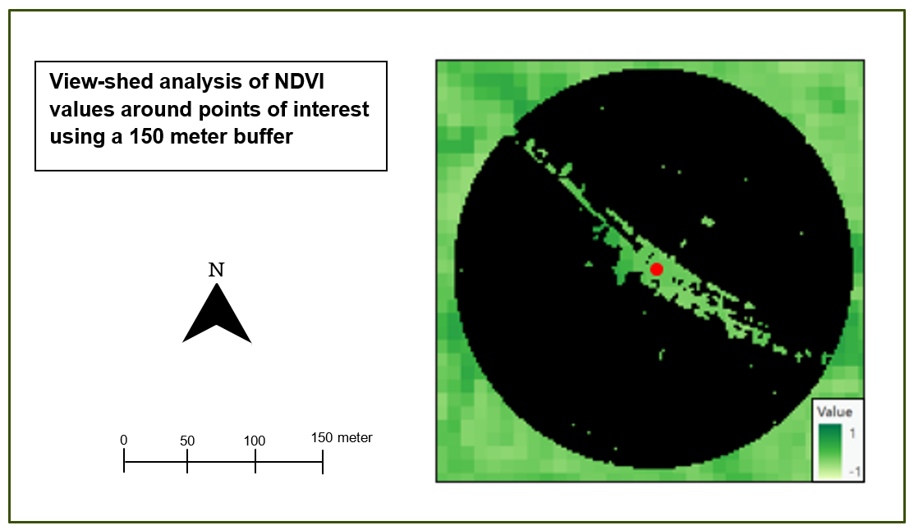

  

    
    
<strong>Optimal Deer Movement Corridor</strong>

  

  

    
    
<strong>Suitable Locations for Weather Stations in the Amazonía Region of Ecuador</strong>

  

  

    
    
<strong>Change in Greenness in Almería, Spain</strong>

  

  

    
    
<strong>Mapping CO₂ Sensitive Areas in the Ocean</strong>

  

  

    
    
<strong>Modelling Banana Yield on a Farm</strong>

  

  

    
    
<strong>Park Coverage vs Count</strong>

  

  

    
    
<strong>Viewshed Analysis</strong>

  

  

    
    
<strong>Illustrated, Antique-Style Map of the Tisza River</strong>

  

