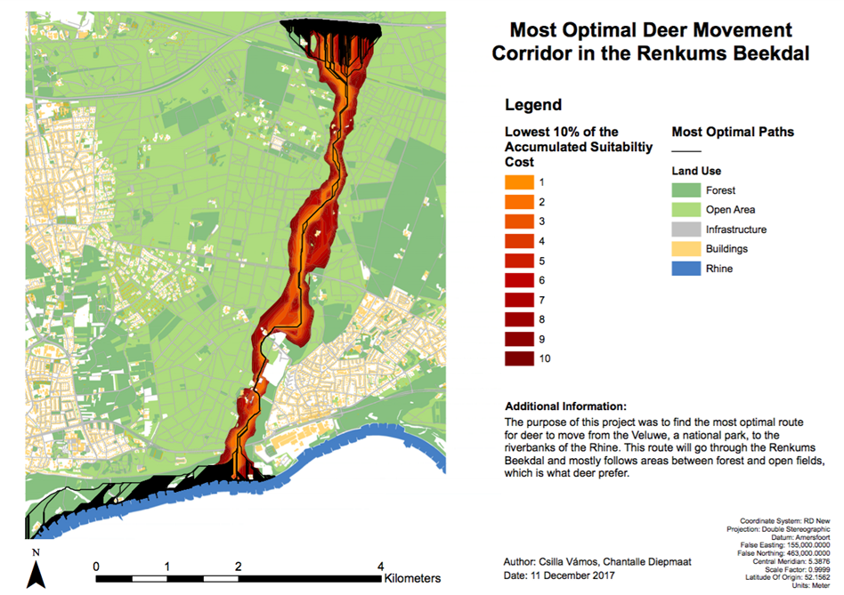
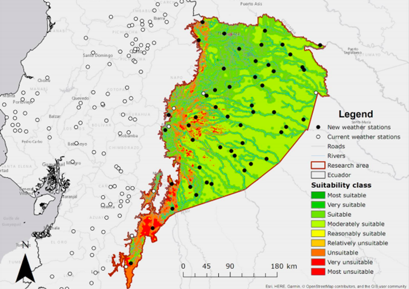
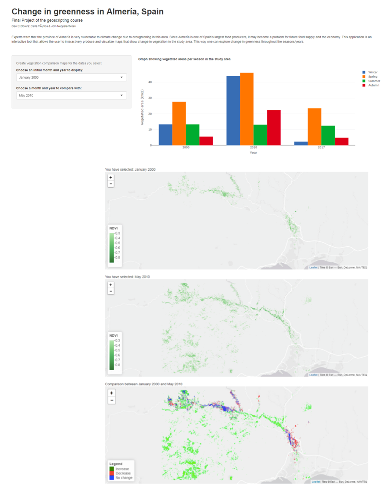
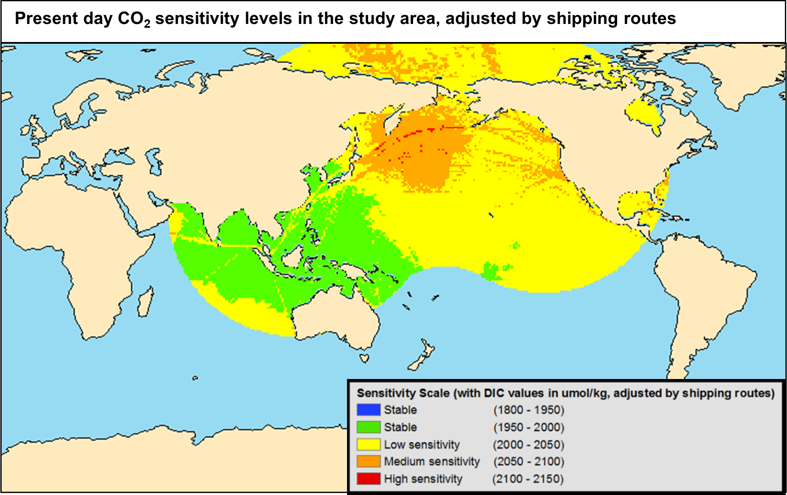
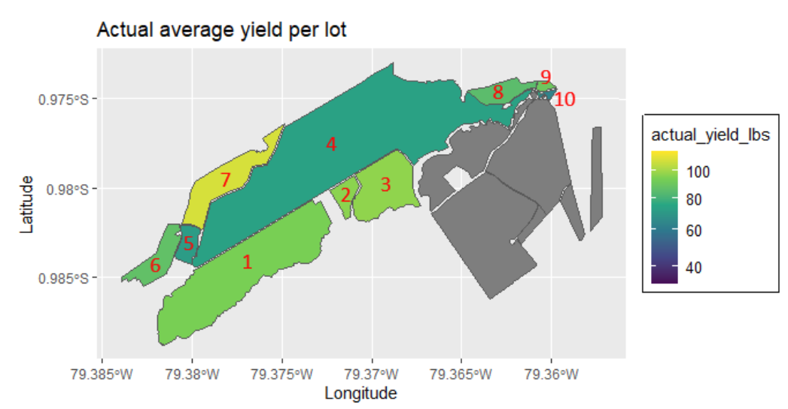

# Portfolio

### [Most Optimal Deer Movement Corridor in the Renkums Beekdal](projects/deer_corridor.md)

---

### [Suitable Locations for Weather Stations in the Amazonía Region of Ecuador](projects/weather_station_suitability.md)

---

### [Change in greenness in Almería, Spain](projects/almeria_NDVI.md)

---

### [Mapping CO2 sensitive areas in the ocean](projects/MS_thesis.md)

---

### [Modelling the banana yield on a farm](projects/banana_farm.md)

---

### [Illustrated, antique-style map of Tisza River](projects/tutaj_terkep.md)

