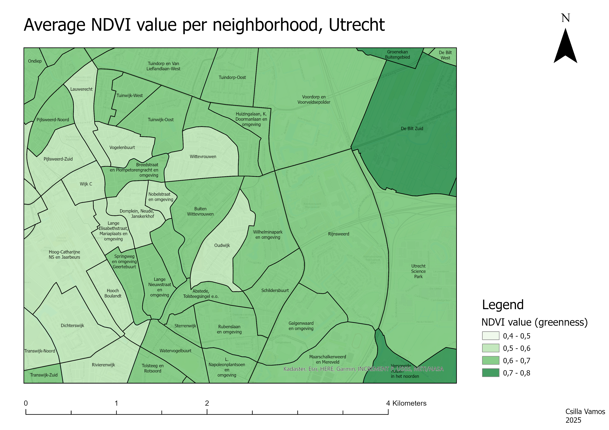

*Made for PhD thesis, Utrecht University*
  

## Project description
Finding the average NDVI value per neighborhood boundary is one way to measure how green local surroundings are.

## Data
- NDVI raster layer
- neighborhood boundaries

## Methods
- Calculating the average NDVI value per neighborhood boundary.

## Tools
- ArcGIS Pro
  

## Outcome
Average NDVI value per neighborhood boundary in Utrecht, higher values indicate more greenery in the area.
