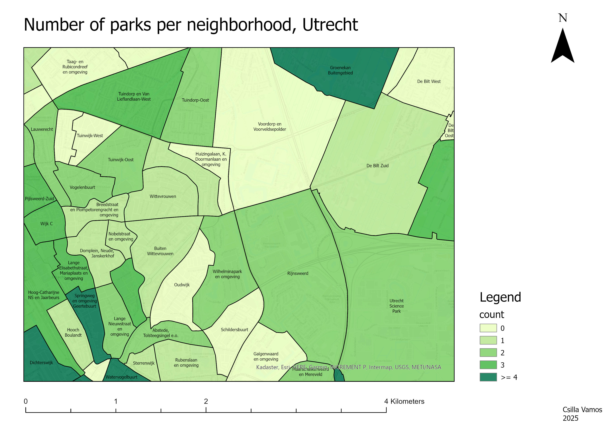
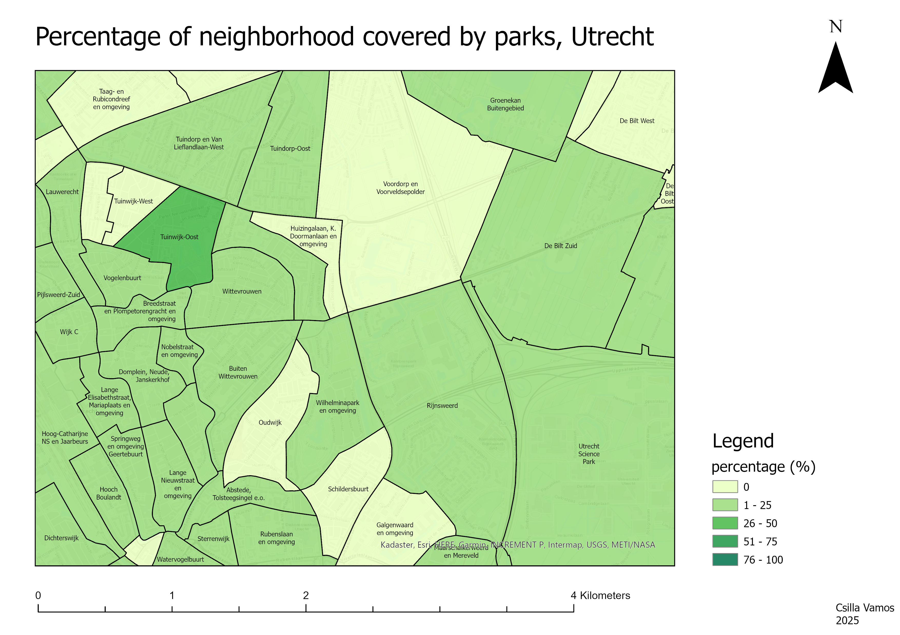

*Made for the PhD thesis, Utrecht University*
  

## Project description
Exposure to parks to neighborhood boundary can be calculated in two ways: finding the number (count) of parks, or determining the percentage of neightborhood that is covereage by a park. Both are valid measurements or park exposure, but can have different results. Which map to use depends on the research question. The objective of this mini project was to highlight to researchers in the field of environmental exposure with little to no background in GIS how using two methods with the same datasets, to explore the same topic, can yield different results. The area depicted in this map is the city of Utrecht, the Netherlands. 

## Data
- park locations
- neighborhood boundaries

## Methods
- Calculating the count of parks within each neighborhood boundary.
- Calculating the percentage of area covered by parks per neighborhood boundary.

## Tools
- ArcGIS Pro
  

## Outcome
Highlights how using the same datasets to explore the same topic can yield different results.
