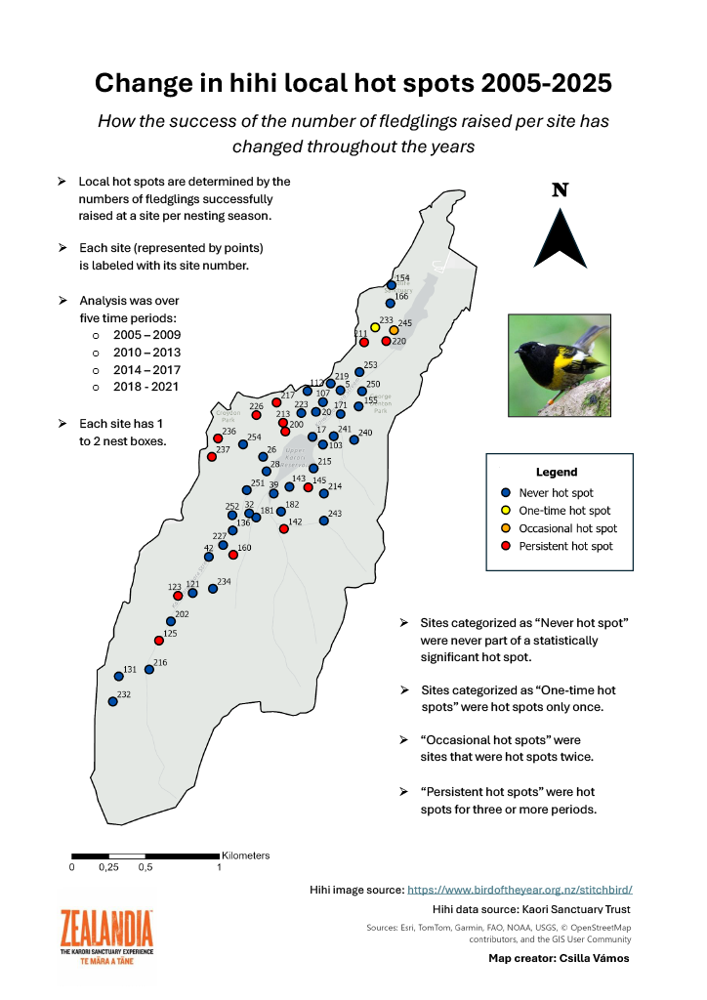
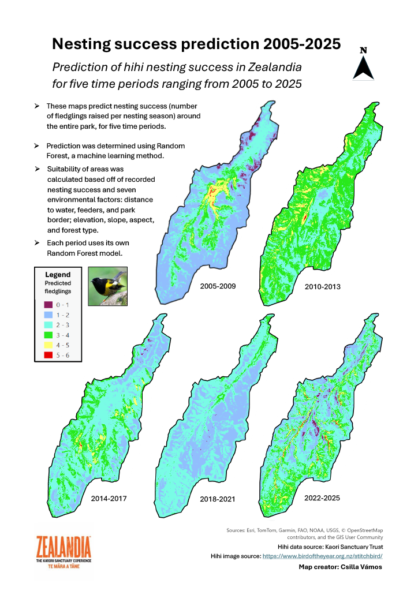

*Made in collaboration with the Kaori Sanctuary Trust*

## Project description
This project explored the spatial patterns seen in the nesting data for hihi (Notiomystis cincta) in Zealandia Te Māra a Tāne, a fenced ecosanctuary in Wellington, New Zealand. Analyses focus on the number of fledglings raised in five periods, each ranging four to five years, starting in 2005 when hihi were reintroduced to the sanctuary. Goals of this study were to 1)	Create maps showing local high and low nesting success per site over the past 21 years, and 2)	Create maps showing where ideal nesting sites across the entirety of Zealandia are, based on  predictions of degree of success (number of fledglings raised) and several environmental factors.

## Data
- hihi nesting data
  
For the prediction maps:
- Distance to the nearest water body (m)
- Distance to the nearest part of the fence on the boundary of the sanctuary (m)
- Type of forest nest box is located in (indigenous forest, broadleaved indigenous hardwoods, or exotic forest)
- Slope degree the nest box is located at (degree)
- Aspect degree of the slope the nest box is located at (degree)  
- Distance to the nearest feeder (m)
- Elevation  (m) 

## Methods
Nesting success maps and statistics using k-nearest neighbor method and Gi* statistics per period were made to visualize and study the degree of each nesting site’s success. Another map was made that showed the changes in nest site occupancy and their nesting success that encompassed all five periods. Prediction maps to predict nesting success of locations within the sanctuary along with statistics using the machine learning Random Forest method, were made for each period and for the entire period of 2005-2025. 

## Tools
- ArcGIS 
- R 

## Outcome
The findings from these maps provide a visual record of a population crash that began around 2019 showing a drop in nesting sucess and lower predictions in fledglings raised for several years. The Random Forest analysis revealed that some environmental characteristics were associated with nesting success, however the degree of importance of each environmental characteristic varied substantially between each period. The maps and the findings in this report can aid biologists and conservationists in their efforts in monitoring the hihi’s nesting success in Zealandia.
