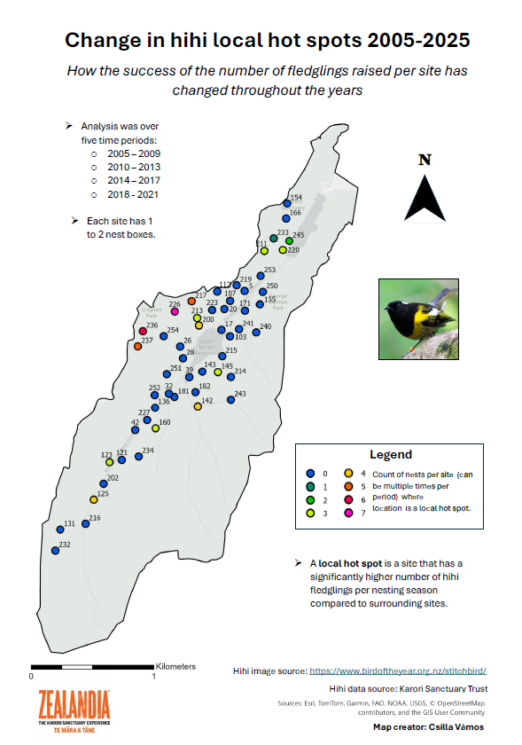
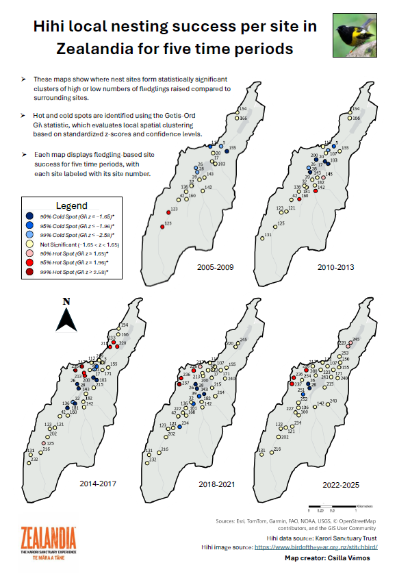
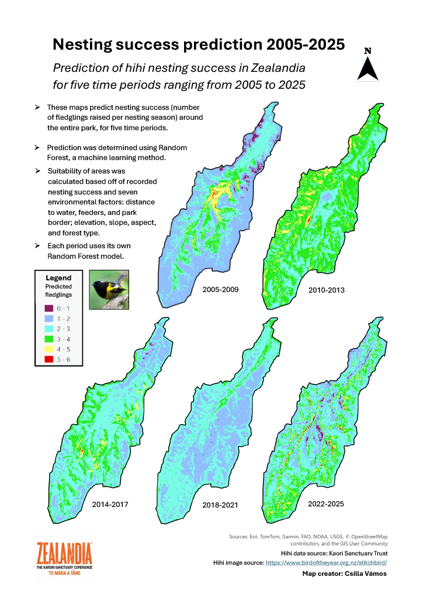

*Made in collaboration with the Kaori Sanctuary Trust*

## Project description
This project explored the spatial patterns seen in the nesting data for an endangered bird species, hihi (Notiomystis cincta) in Zealandia Te Māra a Tāne, a fenced ecosanctuary in Wellington, New Zealand. Analyses focus on the number of hihi fledglings raised in five periods, each ranging four to five years, starting in 2005 when hihi were reintroduced to the sanctuary. Goals of this study were to:

1)	Create maps showing local high and low nesting success per site over the past 21 years.
   
2)	Create maps predicting locations of ideal nesting sites across the entirety of Zealandia, based on a dataset of existing sites' success (number of fledglings raised) and several environmental factors.

## Data
- hihi nesting data
  
For the prediction maps:
- Distance to the nearest water body (m)
- Distance to the nearest part of the fence on the boundary of the sanctuary (m)
- Type of forest nest box is located in (indigenous forest, broadleaved indigenous hardwoods, or exotic forest)
- Slope degree the nest box is located at (degree)
- Aspect degree of the slope the nest box is located at (degree)  
- Distance to the nearest feeder (m)
- Elevation  (m) 

## Methods
For the local hot and cold spots maps and change in hot spots map: 
k-nearest neighbor method and Gi* statistics per period were used to visualize and study the degree of each nesting site’s success. 

For the Prediction maps:
To predict nesting success of locations within the sanctuary along with statistics, a Random Forest method was applied for each period. Prediction maps were made per period rather than one map for the entire 20 years to stabilize results. 

## Tools
- ArcGIS 
- R 

## Outcome
The findings from these maps provide a visual record of the degree of nesting success for each site over time. Findings also confirm a population crash that began around 2019, showing a drop in nesting success and lower predictions in fledglings raised for several years. 

The Random Forest analysis revealed that some environmental characteristics were associated with nesting success, however the degree of importance of each environmental characteristic varied substantially between each period. 

The maps and the findings in this report can aid biologists and conservationists in their efforts in monitoring hihis’ nesting success in Zealandia.
